# STKitSwift

<p align="center">
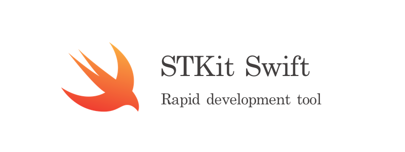
</p>

[](https://github.com/STShenZhaoliang/STKitSwift)

[](https://github.com/Carthage/Carthage)
[](https://swift.org/)
[](https://github.com/STShenZhaoliang/STKitSwift/blob/master/LICENSE)
STKitSwift is a collection of useful classes, structs and extensions to **develop Apps faster**.

Installing and Usage
====================

```ruby

    platform :ios, '12.0'
    xcodeproj 'Project.xcodeproj'
    use_frameworks!
    pod 'STKitSwift'
    
```

## 01.STAlertView

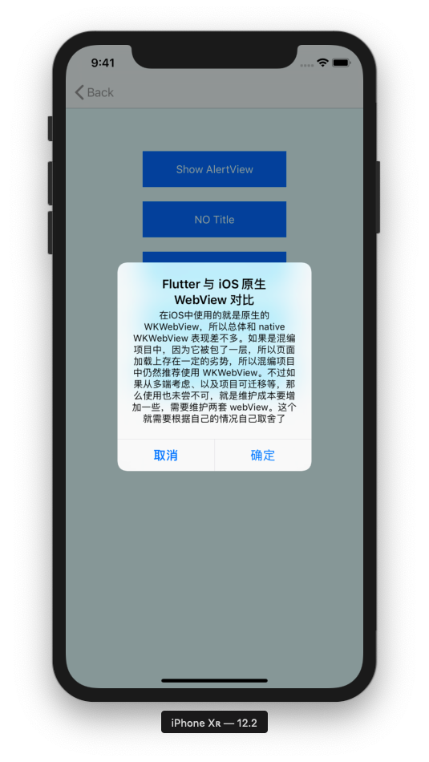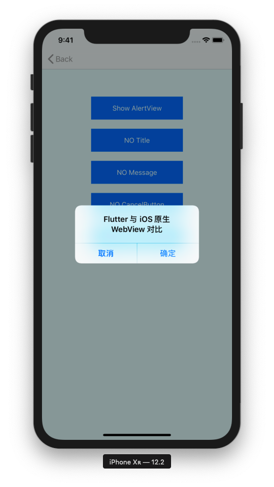

### Installing

```ruby
pod 'STKitSwift/STAlertView'
```

### Example

```swift
let title = "Flutter 与 iOS 原生 WebView 对比"
STAlertView.show(title: title, message: nil, cancelTitle: "取消", otherTitle: "确定") { (item) in
    print(item)
}
```

## 02.STGradientButton

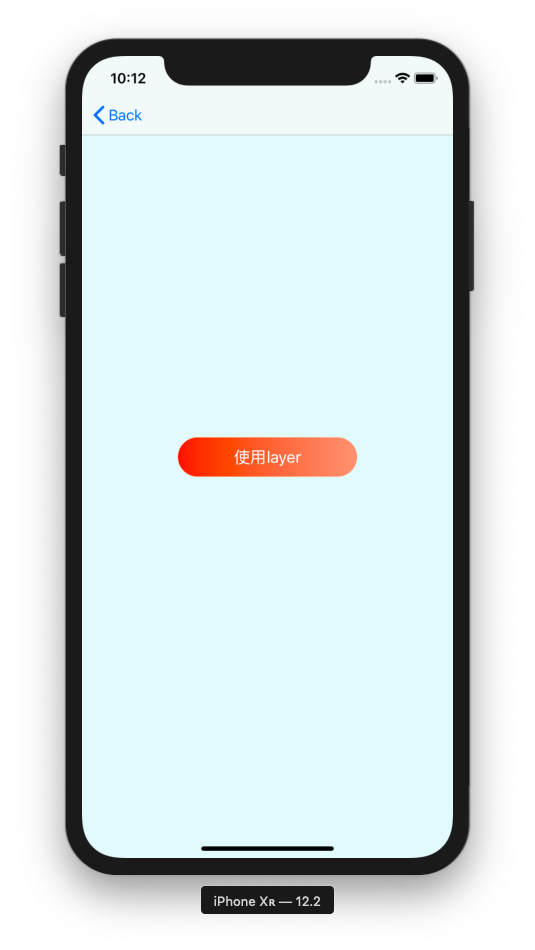

### Installing and Usage

```
pod 'STKitSwift/STGradientButton'
```

## 03.STGradientView

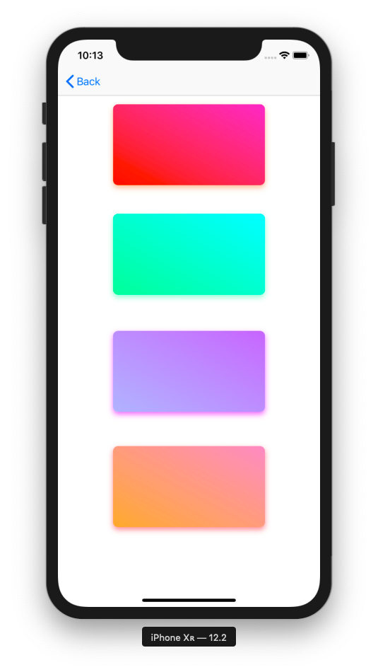

### Installing and Usage

```
pod 'STKitSwift/STGradientView'
```

## 04.STHUD

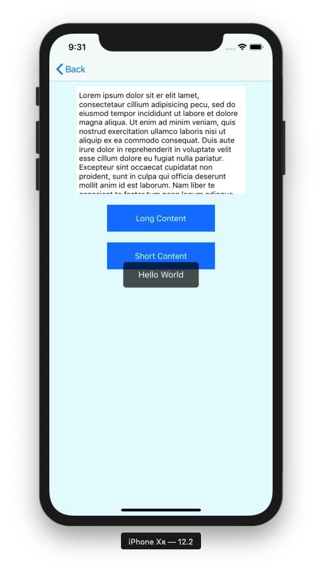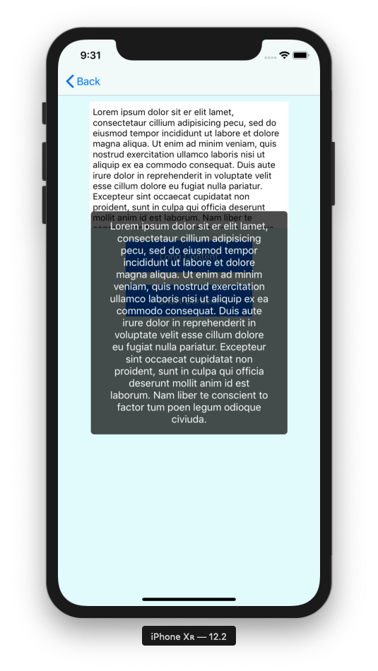

### Installing and Usage

```
pod 'STKitSwift/STHUD'
```

## 05.STMoveButton
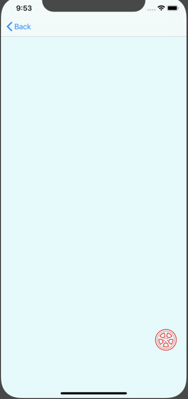
### Installing and Usage

```
pod 'STKitSwift/STMoveButton'
```

## 06.STPhoneTextField
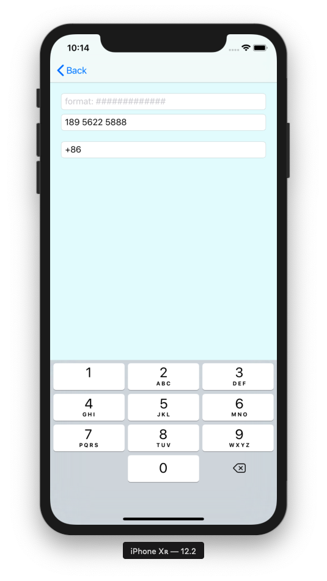
### Installing and Usage

```
pod 'STKitSwift/STPhoneTextField'
```

## 07.STProgressView

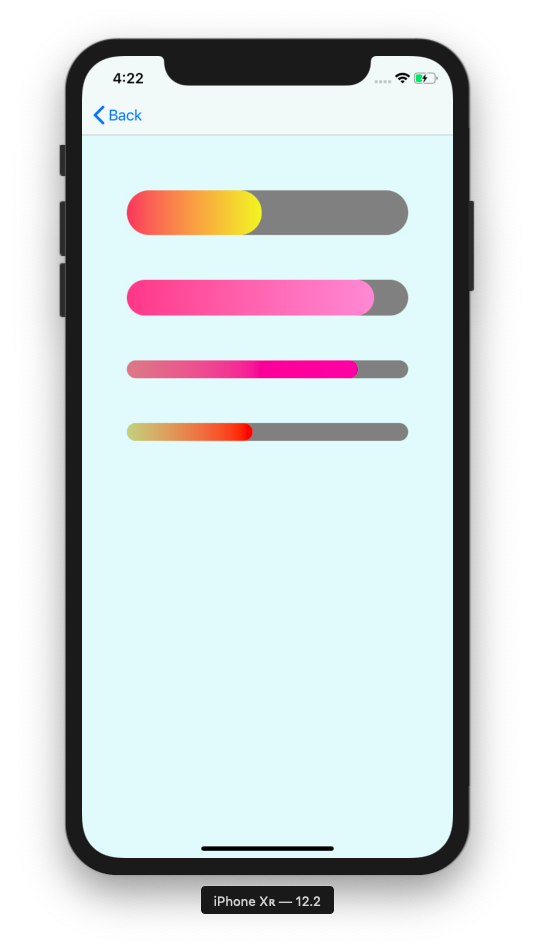

### Installing and Usage

```
pod 'STKitSwift/STProgressView'
```

## 08.STSegmentedControl

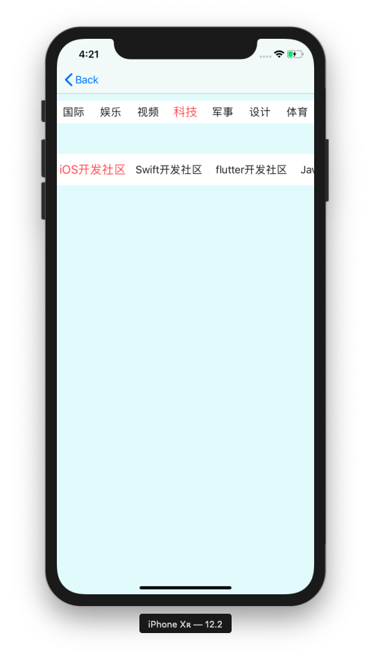

### Installing and Usage

```
pod 'STKitSwift/STSegmentedControl'

```
